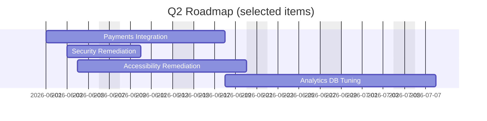

# Project Status Report — Q2 2026

**Project:** Apollo Web Platform

**Report Date:** 2026-06-03

**Prepared by:** Engineering PM — Alex Rivera

---

## Executive Summary

Current status: On Track (with risks)

The Apollo Web Platform team delivered the Phase 2 API integration and completed three major frontend features this quarter. Performance improvements have reduced average page load time by 22%. Key risks include a dependency on the external Payments API (contract negotiation delay) and two outstanding security findings that require remediation.

---

## Milestones & Progress

- Phase 2 API integration — Complete ✅
- User Dashboard v2 — Complete ✅
- Mobile-responsive layout overhaul — Complete ✅
- Payments gateway integration — In progress (60%)
- Accessibility audit remediation — In progress (40%)

### Completed work (highlights)

1. API: Implemented bulk endpoints for user profiles, reducing round-trip calls by 45%.
2. Frontend: Redesigned dashboard widgets and introduced lazy-loading for heavy charts.
3. Ops: Deployed auto-scaling rules to reduce cold-start latency during peak hours.

---

## Roadmap & Next Steps

- Finish Payments gateway contract and complete integration (target: 2026-06-18).
- Address high-priority security findings (expected completion: 2026-06-10).
- Begin performance tuning for database queries on the analytics service (Q3 planning).

---

## Risks & Mitigations

| Risk | Impact | Likelihood | Mitigation |
|------|--------|------------|------------|
| Payments API contract delay | High | Medium | Escalate to partnerships; implement feature flag to gracefully degrade checkout to manual processing. |
| Security findings (XSS vectors) | High | Low-Medium | Dedicated bug-sprint this week; rotate secrets and add additional input sanitation. |
| Analytics DB slow queries | Medium | Medium | Add query index candidates; schedule dedicated profiling session. |

---

## Team Health

- Team Size: 12 (8 engineering, 2 product, 2 design)
- Current blockers: One senior backend engineer on leave until 2026-06-09.
- Morale: Good — recent wins and celebrations after successful release.

---

## Metrics

- Uptime (last 30 days): 99.94%
- Average page load: 1.8s (down from 2.3s)
- Error rate (5xx): 0.08%
- Release frequency: Weekly

---

## Action Items

1. Schedule contract negotiation follow-up with Payments provider (owner: Partnerships).
2. Triage and fix the two security findings (owner: Security Lead).
3. Finalize accessibility fixes and verify with audit vendor (owner: Design).

---

If you want a slide-ready PDF of this report or a distilled 1-slide executive summary, I can generate one from this markdown.